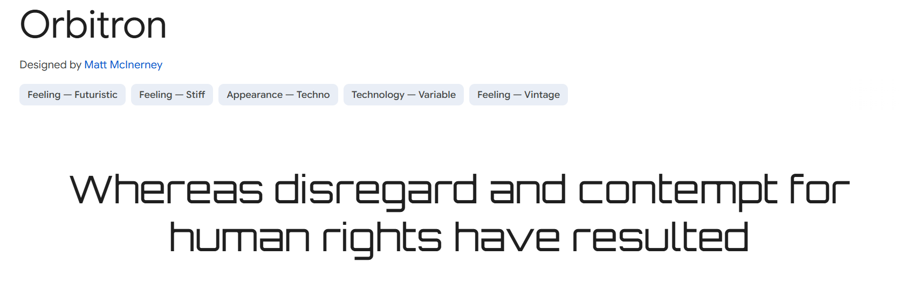
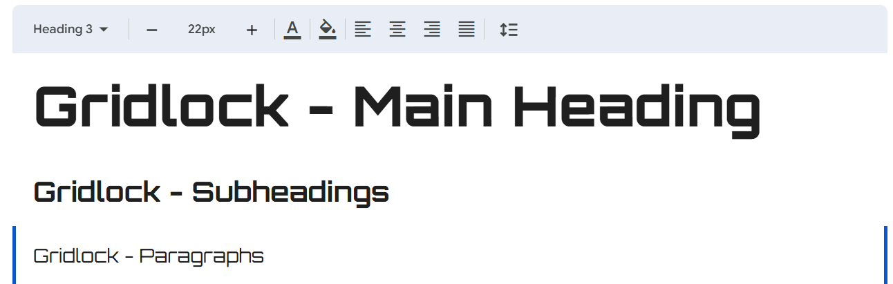
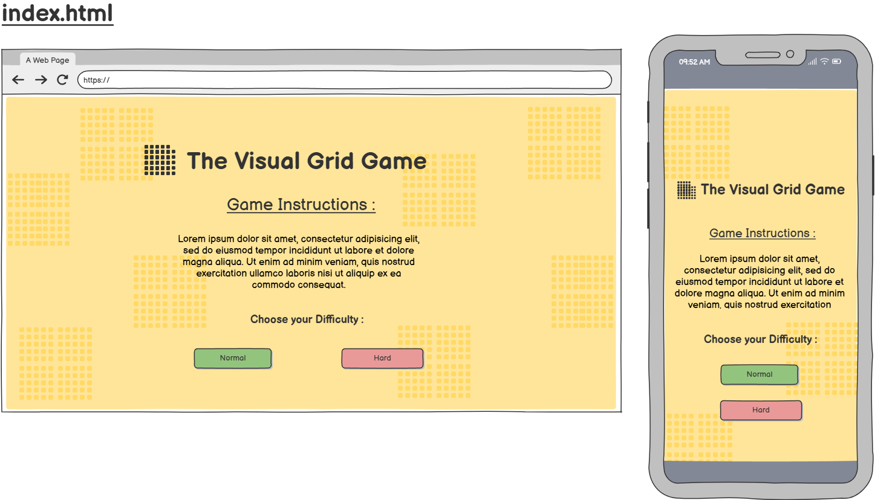
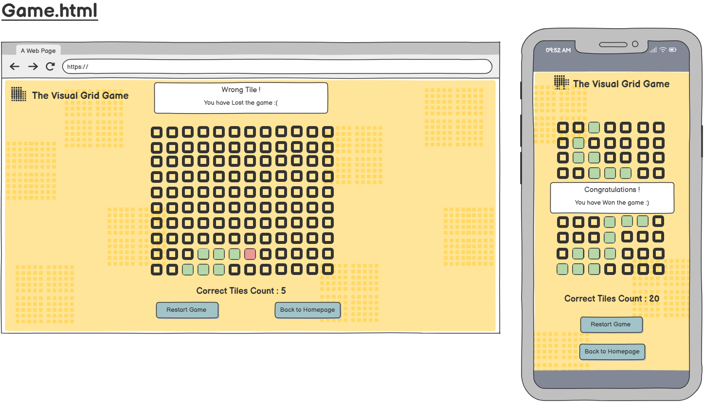

# Gridlock
### The Visual Recall Game 

Gridlock is a memory game that tests your visual recall.Watch carefully as a random pattern of tiles briefly lights up on the grid — then it disappears!
It is up to you to remember and recreate the exact pattern by selecting the correct tiles.

The game is designed to be engaging for both children and adults. Inspired by brain training exercises, the game aims to enhance players' short- and long-term memory over time. The concept is derived from a game show challenge in which participants were shown a grid with a flashing pattern of connected tiles that formed a path. After a brief moment to memorize the pattern, the players had to physically step on the correct tiles.

Gridlock follows a similar premise, challenging players to memorize and recall tile patterns under pressure.

## Contents
**[User Experience (UX)](#user-experience-ux)**
* [Project Expectations](#project-expectations)
* [User Stories](#user-stories)

**[Design](#design)**
* [Colour Scheme](#colour-scheme)
* [Typography](#typography)
* [Imagery](#imagery)
* [Wireframes](#wireframes)

**[Features](#features)**

**[Accesibility](#accesibility)**
* [Future Implementation](#future-implementation)

**[Testing](#testing)**

**[Technologies Used](#technologies-used)**
* [Frameworks, Libraries & Programs Used](#frameworks-libraries--programs-used)

**[Credits & Code Used](#credits--code-used)**
* [Content](#content)
* [Media](#media)
* [Credits](#credits)

## User Experience (UX) 
### Project Expectations 
The overall output for this project is as follows:

* Introductory Page : This page provides a description of the game and explains how to win. It includes two buttons.
* Game page (Normal): This page hosts the gameplay, featuring a 5x5 grid along with Home and Restart buttons.
* Game page (Challenging): This page hosts the gameplay, featuring a 5x5 grid along with Home and Restart buttons.

### User Stories 

---
**First Time Visitor** 

"As a first-time visitor, I want to have an enjoyable and intuitive experience while playing the game and navigating the website."

Tasks:
* Ensure the website is fully responsive and functions well across all device types.
* Design an introductory page that provides a clear and concise explanation of the game and its objectives.
* Implement a score counter to help players easily track their progress during gameplay.
* Add a countdown timer that shows how much time the player has to memorize the pattern and signals when the game begins.
* After completing a game, provide options to restart or return to the homepage.
---
**Returning Visitor** 

"As a returning visitor, I want to challenge myself by selecting different difficulty levels to enhance my gameplay experience."

Tasks:
* Implement buttons that allow players to choose from various difficulty levels.
* Increase game difficulty by:
    * Expanding the grid size.
    * Reducing the time available to memorize the pattern.
    * Introducing visual distractions to make the game more challenging.
---
**Frequent Visitor** 

"As a frequent visitor, I want to improve and monitor my memory and focus over time, with the ability to view my past scores and track progress across multiple visits."

Tasks:
* Enable players to adjust the game's difficulty to match their skill level.
* Implement a system to save and retrieve scores from previous site visits, allowing users to track their long-term improvement.

## Design
### Colour Scheme

The color scheme evolved naturally as I progressed with designing the site, coming together gradually.

I opted for a pastel color palette with energetic yet muted tones, which I believe blend together beautifully and complement the overall feel of the game.

### Typography

Given the simplicity of the color palette, I aimed to create contrast by using an interesting font consistently throughout the website. After exploring various options, I selected 'Orbitron' for its futuristic and sleek aesthetic.
 

 My secondary font choice is 'Verdana', which I believe pairs well with Orbitron due to its readability and clean lines. In the event that Orbitron fails to load, Verdana ensures a consistent and legible fallback. I’ve also utilized various font weights to clearly distinguish between headings and body text throughout the site.

I've applied multiple font weights to differentiate between headings and paragraphs, enhancing the site's visual hierarchy and readability.

### Imagery

No imagery was used in the design. Instead, I incorporated an icon from Font Awesome to serve as a simple, logo-like visual element.

### Wireframes

The wireframes for this project were created in Balsamiq prior to the development phase. Please note that the working title used at the time was "Visual Grid Game." This was later changed to the final name, "Gridlock."

index.html Wireframe

 

Normal.html & Challenge.html Wireframe

 

## Features 
My website is fully responsive, providing optimal viewing and functionality across all screen sizes—from mobile devices to desktop monitors

The website consists of three main pages: an Introduction page, and two gameplay levels—Normal and Challenging

**Home Page**

 **Favicon/Logo**

 My favicon effectively represents the name of the game, 'Gridlock.' 
 [See Icon Here](assets/images/icon.png).
 It features a grid with arrows pointing in opposite directions alongside a lock icon—visually capturing the concept in a straightforward yet fitting manner. While it's quite literal, I believe it complements the overall theme well.

---
**Introductory Page**

The Introduction page features the main title of the game and provides an overview of the game’s objectives and winning criteria. Below this, two buttons allow players to select their preferred difficulty level. 
*Additionally, there is a section for returning visitors to view their previous scores*

---
**Game Page - Normal**

This page features a 5x5 grid, consistent with the layout used across both difficulty levels. Common elements include the grid structure, a 'Restart' button, and a 'Back to Homepage' button. 

[5x5 Highlighted Grid](assets/images/Homeimage.png)

The "Restart" button resets the game by generating and briefly highlighting a new pattern, which disappears after a set period. A countdown timer indicating the remaining time is displayed above the grid and vanishes once the pattern is hidden.

The "Back to Homepage" button redirects players to the Introduction page. Additionally, a "Correct Tile Counter" is present to track the number of correctly selected tiles during gameplay.

---

**Game Page - Challenging**

All game pages share a consistent visual layout, with variations only in the grid size, the number of tiles to memorize, and the memorization time allocated. The difficulty level influences these elements—the more complex the pattern, the more time is provided to memorize it.
[7x7 Highlighted Grid](assets/images/Homeimage.png)
This particular page features a 7x7 grid, offering a greater challenge due to the increased number of tiles, which raises the likelihood of errors and demands sharper focus

##  Accesibility
**Semantic HTML**

Used elements like **header, main, nav and section** to define, describe, and separate different areas of the page for better structure and accessibility.

**Color Contrast**

**Red-Green Color Blindness**

**Hover & Sound Effects on Interactive Elements**

Added hover and sound effects to interactive elements like buttons and clickable boxes within the game to improve user engagement.

**Font**

### Future Implementation
I ended up using two JavaScript files. In hindsight, I should’ve tried to stick to just one file for each — it would’ve made everything a lot cleaner and easiier to maintain.  The reason I split things up was because I had some features I wanted to add, but I thought of them near the end of the project. Implementing them would’ve had a knock-on effect on the rest of my code, and I couldn’t quite figure out how to add them seamlessly. So instead, I resorted to creating another JS file to handle them.

If I had more time to enhance this project, I would consider implementing the following features:

* Instructional Modal: Introduce a modal popup that appears before gameplay begins, providing clear instructions instead of using standard browser alerts. This would improve readability and overall user experience.

* Implement a system to save and retrieve scores from previous site visits, allowing users to track their long-term improvement.

* Thematic Pattern Design: Replace fully random patterns with more intentional, visually recognizable designs—such as patterns resembling simple drawings. This would open the door to different thematic levels and a more engaging aesthetic.

* Customization Options:
    * Allow players to adjust the grid dimensions along both the x and y axes.
    * Enable customization of the number of boxes to memorize.
    * Let users set their own memorization time, offering a tailored experience based on skill level.

* Timed Challenge Mode: Add a “Race Against the Clock” mode where players must complete the pattern before time runs out. In this mode, selecting an incorrect tile or running out of time would result in a loss.

* Hints for Advanced Levels: For higher difficulty settings, provide a limited-use hint feature that allows players to briefly view the pattern again, supporting strategic gameplay without compromising challenge.

Some of these features were referenced in my user stories—primarily aimed at frequent visitors—but they were not prioritised for this project and ultimately omitted due to time constraints.

### Testing 
*Please refer to **[TESTING.md](TESTING.md)** document. 
This will outline all of the testing and debugging processess*

## Technologies Used

**Languages:**
This project required the use of HTML , CSS and Javascript.
### Frameworks, Libraries & Programs Used
* **[Balsamiq](https://balsamiq.com/)** To build page by page wireframes.

* **[Git & Github](https://github.com/)** Version control ,saving and storing files for the site respectively.

* **VSCode** The coding environment used to create the site.

* **[Google Fonts](https://fonts.google.com/)** To import the fonts used on the website.

* **[Font Awesome](https://fontawesome.com/)** To get icons.

* **ChromeDevTools** To troubleshoot and test features, solve issues with the JS logic.

* **[Favicon.io](https://favicon.io/)** To create favicon.

* **[Am I Responsive?](https://ui.dev/amiresponsive)** To show the website image on a range of devices.

## Credits & Code Used
## Content
All written content was composed by myself. I refined the flow and readbility of the text via Grammarly.
### Media
As for media, I chose not to use any external images, as I felt they weren’t necessary. 
However, I did implement a sound effect for all buttons and boxes within the game grid, using an audio file downloaded from [Pixabay](https://pixabay.com/sound-effects/search/button/).

## Credits 

Below, I’ve listed a few resources that assisted me in creating the game. I made use of several tutorials and frequently referred back to the [Code Institute Course]() for guidance on various aspects of my JavaScript code.  These resources may also be mentioned again in my testing document, as they were helpful in resolving certain bugs.

I found myself frequently returning to the discussion boards and articles on these particular resources:

* [Free Code Camp](https://www.freecodecamp.org/)
* [StackOverflow](https://stackoverflow.com/questions)
* [MDN WebDocs](https://developer.mozilla.org/en-US/ )

* [Help Article - Prevent Repeating Numbers in Array](https://forum.freecodecamp.org/t/how-to-make-math-random-not-repeat-same-numbers/417973/2) 

[Help Article - Timing Events](https://www.w3schools.com/js/js_timing.asp#:~:text=The%20setTimeout()%20Method,number%20of%20milliseconds%20before%20execution.)
[Help Article - Timing Events](https://forum.freecodecamp.org/t/settimeout-func/597888)

https://www.w3schools.com/jsref/jsref_from.asp - Array from 

https://www.youtube.com/watch?v=x7WJEmxNlEs&t=3s - countdown timer 

https://stackoverflow.com/questions/29022829/increment-score-using-javascript

https://stackoverflow.com/questions/24768067/display-alert-only-once
---
[Back to the top](#gridlock)