# Gridlock - Testing
During the testing phase of the game, I focused on documenting bugs as soon as I encountered them. Once again, Chrome DevTools proved to be incredibly helpful throughout this process. Due to time constraints, I wasn’t able to fully implement tests using Jest. Instead, I relied on console logging to verify that everything was functioning correctly on the backend.

[View Deployed site](https://augustinagonja.github.io/grid-lock/)

## Contents
**[Automated Testing](#automated-testing)**
* [Html Validator](#wc3-html-validator)
* [CSS Validator](#wc3-css-validator)
* [JS Validator](#js-linter)

**[Performance Testing](#performance-testing-lighthouse)**
* [Desktop](#desktop)
* [Mobile](#mobile)

**[Performance Results](#performance-results)**

**[Manual Testing](#manual-testing)**
* [Testing User Stories](#testing-user-stories)

**[Full Testing](#full-testing)**
* [Devices Tested On](#devices-tested-on)
* [Page Feature Testing](#page-feature-testing)

**[Solved & Known Bugs ](#solved--known-bugs)**

**[Deployment & Local Development](#deployment--local-development)**

## Automated Testing
### WC3 HTML Validator
* [index.html](testing/Validators/index.html%20validator.png)
* [Normal.html](testing/Validators/Normal.html%20validator.png)
* [Challenge.html](testing/Validators/Challenge.html%20validator.png)

The "cells" attribute within the div flagged an [error](testing/Validators/gamelevel%20html.png). Since these aren't important and I mainly used them for reference, I could safely remove them without affecting my code.

The consistent [issue](testing/Validators/index.html%20error.png) I encountered with my html was with the anchor tags nested inside the buttons. I removed the button element and and styled the anchors in CSS.
### WC3 CSS Validator
* [style.css](testing/Validators/css%20pass.png)  
**Passed** 

I initially encountered a [Parse Error](testing/Validators/css%20error.png), but I removed the styling elements that caused it, as they didn't significantly affect the appearance. I ran it through the validator, and it passed.
### JS Linter
* [game.js](testing/Validators/jslint.png)  
* [game.c.js](testing/Validators/jslint.png)  

The two js files are identical except for the values of some variables. 

No major issues, aside from the ones mentioned above. The two errors flagged are functioning correctly with the proper syntax.

# Performance Testing (Lighthouse)
**Wave Contrast Checker**

All pages pass the color contrast checker, ensuring accessibility and readability for all users.
* [index.html](testing/Performance/index.con.png)
* [Normal.html](testing/Performance/normal.con.png)
* [Challenge.html](testing/Performance/challenge.con.png)

## Performace Results 
### Desktop
All four aspects of performance on desktop scored above 90.  However, Chrome extensions had a small impact on the overall performance..
* index.html
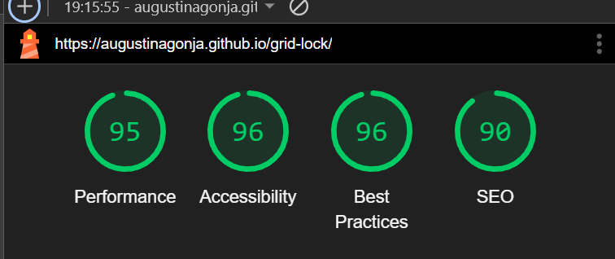
* Normal.html
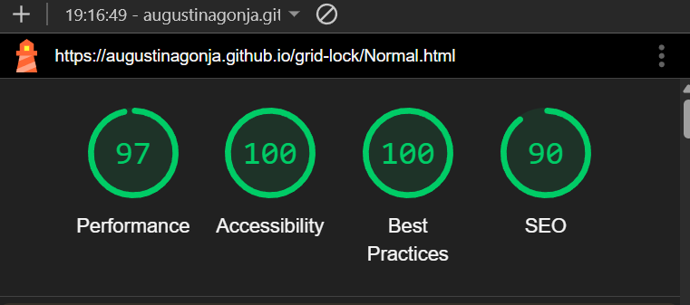
* Challenge.html
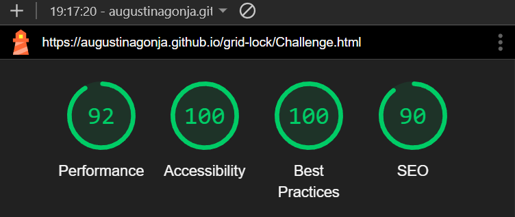
### Mobile 
Everything except for Performance scored above 90. Chrome extensions had a significant impact on overall performance, particularly on mobile.
* index.html
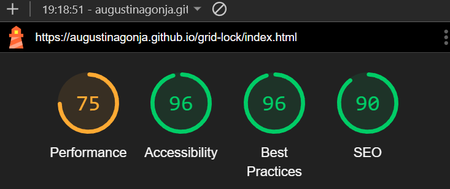
* Normal.html
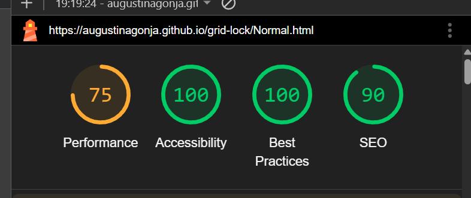
* Challenge.html
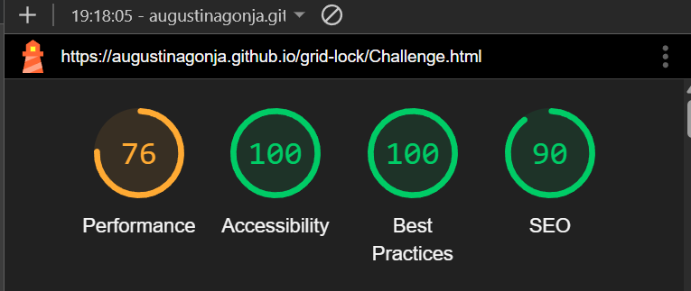

## Manual Testing
### Testing User Stories

| **User Story** | **How are they achieved?** | **Image** |
| :--- | :--- | :--- |
|`First Time Visitor` "As a first-time visitor, I want to have an enjoyable and intuitive experience while playing the game and navigating the website."|The website is fully responsive, providing a smooth experience across all devices.  A clear and concise game guide is provided, with instructions repeated right before gameplay begins.  Instructions vary depending on the selected level to ensure clarity.|[Responsiveness](assets/images/amiresponsive%20.png) [Instructions](testing/User%20Stories/us.1.png)|
| `Returning Visitor` "As a returning visitor, I want to challenge myself by selecting different difficulty levels to enhance my gameplay experience." |Buttons implemented so that users can easily return to the homepage and switch between difficulty levels.   Grid size and time to memorise patttern changes between levels |[Level Buttons](assets/images/Level%20Buttons%20.png) [Normal Level Grid](assets/images/5x5%20Grid.png) [Challenge Level Grid](assets/images/6x6%20Grid.png) |
|`Frequent Visitor`  "As a frequent visitor, I want to improve and monitor my memory and focus over time, with the ability to view my past scores and track progress across multiple visits."|Two difficulty levels are available for players to choose from.  Players can partially track their progress using the score counter.  **There is no way to view scores from previous site visits , but will be implemented in future so that this user story is fully met**|[Score Counter](assets/images/score.png)|

## Full Testing
### Devices Tested On

Laptop

* Lenovo Legion 5 15.6 in

Mobile

* Iphone 14 SE - Safari
* Iphone 12

Browser
* Google Chrome
* Microsoft Edge
* Safari

### Page Feature Testing

| Feature | Expected Outcome | Testing Performed | Result | Pass/Fail |
| --- | --- | --- | --- | --- |
| Buttons on Homepage | Link directs the user to the game at either normal or challenging level | Button Clicked | Game page opens | Pass |
| Alert | Pops up as soon as user enters game page | Page reload | Alert pops up at top of page | Pass |
| Grid Boxes| After the pattern is displayed, the boxes change color.  Once the game is over, all clicks are disabled until the game is restarted.| Clicked on box |Box turns the correct color (Green/Red)| Pass |
| Timer |The countdown timer begins only after the user clicks "OK" on the alert message. | Clicked "OK" in alert | Timer counts down  (time depends on level chosen)| Pass |
| Restart Button| Restarting the game generates a new pattern for the player| Clicked on button | Game restarts | Pass |
| All buttons hover effect| Buttons expand on hover| Hover over button | Button expands on hover | Pass |
| Feedback Form | Allows player to submit simple feedback about game. Form will not submit if option has not been clicked.  | Click submit | Form submit if correct input otherwise will prompt user to select radio button | Pass |

# Solved & Known Bugs 
## Solved Bugs 
| No | Bug | How I solved the issue |
| :--- | :--- | :--- |
| 1 | When the pattern array is logged to the console, some indexes appear more than once. This can lead to issues, as the same boxes might be highlighted multiple times during the game.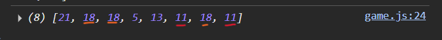| To prevent any repeated numbers, I added an if statement that filters out any numbers already present in the pattern. For assistance , I used this [Help Article](https://forumfreecodecamp.org/t/how-to-make-math-random-not-repeat-same-numbers/417973/3) .|
| 2 | Reference Error occurred in the generatePattern function, indicating that the randNum variable was undefined.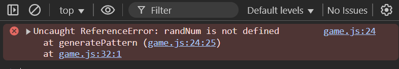| I moved the randNum declaration to the top of the function because it wasn’t visible to the if statement — it was outside its scope. |
| 3 | Pattern array has reverted back to repeating again, but this time it repeats the exact same number 8 times.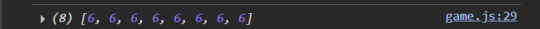|Commented out parts of the code to check what would be logged in console.Found that the first pattern.push(randNum) was causing the issue and making the indexes repeat again. [Fix](testing/Bugs/e5.png)  & [Result logged in Console](testing/Bugs/e6.png).|
| 4 | Reference Error occurred in the revealPattern function, indicating that the randNum variable was undefined.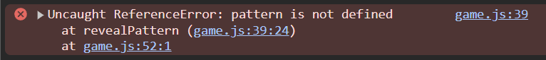| I defined pattern outside the generatePattern function so it could also be accessed by the revealPattern function.( Was previously defined INSIDE the generate function)|
| 5 | Type Error occurred in the revealPattern function.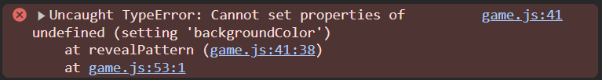  [Error Code](testing/Bugs/e9.png)| I couldn’t color pattern[i] properly since I needed to access and style the actual boxes it was referring to. [Fix](testing/Bugs/e8.png) .|
| 6 | Website Unresponsive and not loading.Issue within the Javascript, as when commented out , the website loads and its appearance is restored. [Loading](testing/Bugs/e10.png)| Calling the generatePattern function caused this issue. [Fix](testing/Bugs/e8.png)|
| 7 | Variable had already been declared at start of JS script, unable to use for function.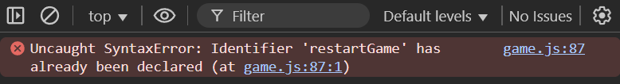| Rename variable to restartButton [Fix](testing/Bugs/e12.png)|
| 8 |When the game starts and the pattern is revealed, the player is unable to select any of the boxes-nothing happens upon clicking..Error in userClick function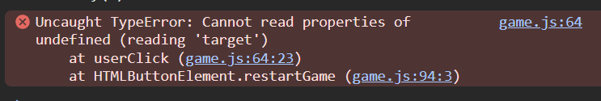| There are some syntax issues: brackets need to be added around selectedBox, and the second if statement is missing curly braces. Also, check the overall order of your code for proper structure.  [Fix](testing/Bugs/e8.png)|
| 9 | Grid does not clear after you have lost or won a game. [Error](testing/Bugs/e15.png)|Add another for...of loop within the restartGame function to reset the boxes to their original state by restoring the default blue color.  [Fix](testing/Bugs/e8.png)|
| 10 | Countdown variable not defined. [Reference Error](testing/Bugs/e16.png)|Accidentally defined the countdown variable twice in the JS script.|
| 11 | Countdown not counting down. [Reference Error](testing/Bugs/e17.png)| Certain elements needed to be moved inside the else block to ensure they execute only once, rather than repeatedly. [Fix](testing/Bugs/e18.png)|
| 12| The last tile clicked before losing or winning the game doesn't change color as expected. [Reference Error](testing/Bugs/e19.png)| Add setTimeout to function after Stop Click is called.|

## Known Bugs 
| No | Bug | Issue |
| :--- | :--- | :--- |
| 1 |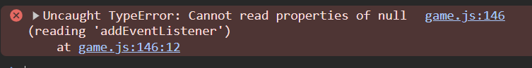| The issue remains unresolved — the scoreCounter is correctly defined at the top of the JS file, so it's unclear why the error is occurring. Despite this, the game functions as expected.  [Error](testing/Bugs/e22.png)

# Deployment & Local Development
**Deployment Process**

The process to deploy my game on GITHUb pages was fairly straightforward

Below are the steps I took:

* Find the [Repository for Gridlock](https://augustinagonja.github.io/grid-lock/)
* Go to Settings (situated on the top menu)
* Once in Settings find the "Code and automation" heading on the left hand side and navigate down to "Pages"
* Go to "Build and deployment". 
* In the "Source" dropdown select "Deploy from a branch".Then in the "Branch" dropdowns select "main" and "/(root)"respectively and save.

* Go back to main page in repository and wait a couple of minutes before refreshing.
* On the right hand side there should be a heading called "Deployments" , click this to view your deployed website.

### Local Development

**How to Fork**

Process of copying a repo to another GitHub account allowing for collaboration. Changes wont affect the original unless pushed. 

* Login to Github and locate the repository for Gridlock.
* Find the Fork Button. 

**How to Clone**

Process of copying the repo into your machine.
* Log in to GitHub and find the Gridlock repository.
* Click the Code dropdown, select HTTPS, and copy the URL.
* In VSCode (or another editor), open a terminal and run - git clone followed by the url.
* Make changes, then push them to see the updates in the GitHub repo.
---
[Back to the top](#gridlock---testing)